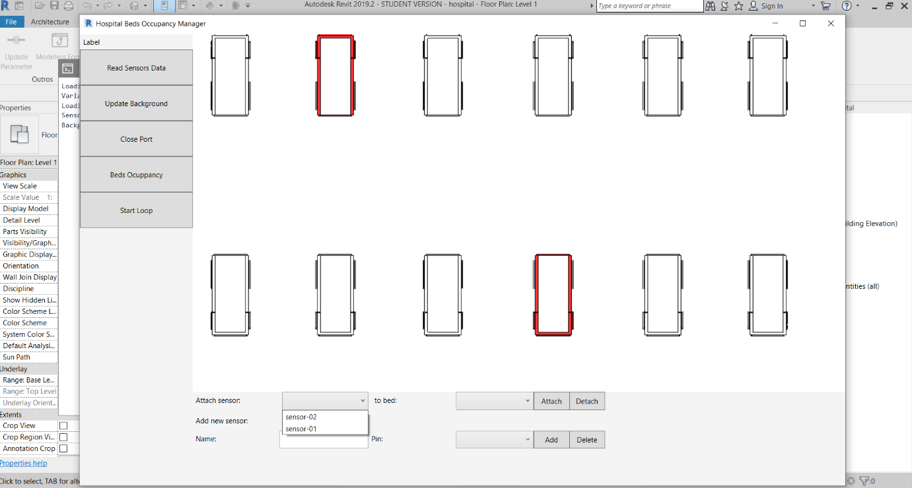
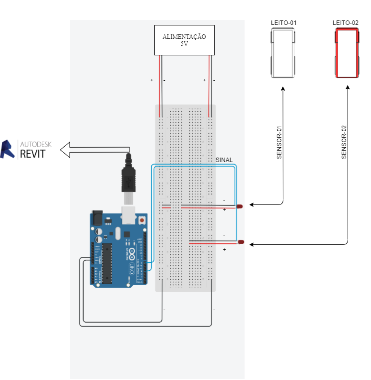

# Revit hospital beds occupancy in real time  
  
This project was developed during COVID-19 pandemic between 2020 and 2021.  
  
This program is a [PyRevit](https://github.com/eirannejad/pyRevit) Extension that integrates a [BIM](https://en.wikipedia.org/wiki/Building_information_modeling) model and sensors in order to gather hospital beds occupancy data. The main motivation was explore possible solution for the health system collapse through quicker hospital bed occupancy data.  
  
First, the [Autodesk Revit](https://en.wikipedia.org/wiki/Autodesk_Revit) software was used to build a simplified model of a hospital and with the use of a PyRevit add-in, the information collected by the sensors was processed and presented in a simple and intuitive way, facilitating the monitoring of bed occupancy.   
  
Therefore, it was possible to centralize the access to all static information, such as materials, suppliers, schedules and number of beds occupied, as dynamic information, in a quick and visual way.  
   
  
### Technologies used  
- [PyRevit](https://github.com/eirannejad/pyRevit)
- [pyFirmata](https://github.com/tino/pyFirmata)
- [Autodesk Revit](https://www.autodesk.com/products/revit/)
- Python
- XAML for UI
- Arduino UNO
- Infrared sensors

  
### Screenshots  
  
  
  
  

